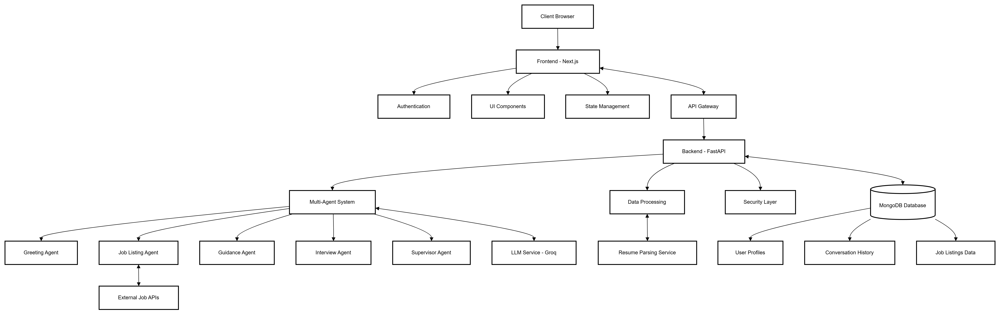
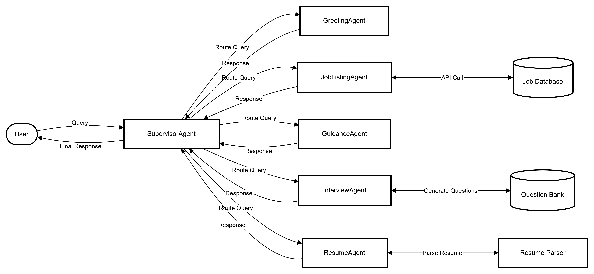
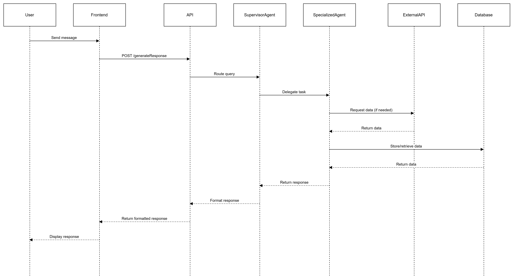
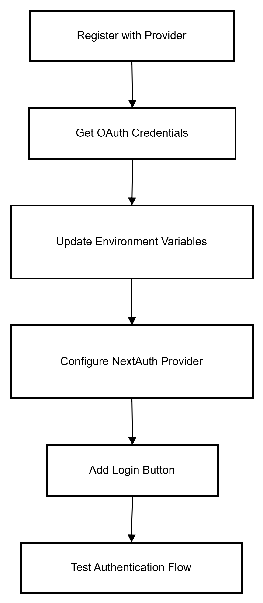
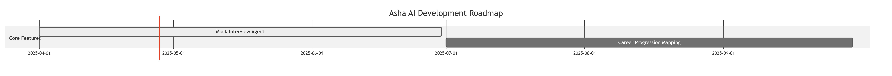

# Asha AI Chatbot: Technical Documentation

## Table of Contents
1. [Architecture Overview](#1-architecture-overview)
   - [System Architecture](#11-system-architecture)
   - [Multi-Agent System](#12-multi-agent-system)
   - [Data Flow](#13-data-flow)
2. [Technology Stack](#2-technology-stack)
   - [Frontend Technologies](#21-frontend-technologies)
   - [Backend Technologies](#22-backend-technologies)
   - [Database](#23-database)
   - [DevOps & Infrastructure](#24-devops--infrastructure)
3. [Setup Instructions](#3-setup-instructions)
   - [Prerequisites](#31-prerequisites)
   - [Frontend Setup](#32-frontend-setup)
   - [Backend Setup](#33-backend-setup)
4. [Integration Process](#4-integration-process)
   - [Integrating with External Job APIs](#41-integrating-with-external-job-apis)
   - [Integrating with Authentication Providers](#42-integrating-with-authentication-providers)
   - [Integrating with Resume Parsing Service](#43-integrating-with-resume-parsing-service)
5. [Customization Guide](#5-customization-guide)
   - [Styling and Branding](#51-styling-and-branding)
   - [Adding New Agent Types](#52-adding-new-agent-types)
   - [Customizing Job Card Display](#53-customizing-job-card-display)
6. [Troubleshooting](#6-troubleshooting)
   - [Common Issues](#61-common-issues)
   - [Logging](#62-logging)
   - [Support](#63-support)

---

## 1. Architecture Overview

### 1.1 System Architecture

Asha AI employs a modern microservices architecture with the following key components:


**Frontend Layer:**
- Next.js application with React components
- Client-side state management with Context API
- Server-side rendering for improved performance and SEO

**Backend Layer:**
- FastAPI Python backend
- Multi-agent AI system architecture
- RESTful API endpoints for frontend communication

**Database Layer:**
- MongoDB for persistent data storage
- Document-based schema for flexible data modeling

**External Services:**
- Groq LLM API for natural language processing
- Resume parsing service for document analysis
- Job listing APIs for real-time job data

### 1.2 Multi-Agent System

The core intelligence of Asha AI is its multi-agent system:



- **Supervisor Agent**: Orchestrates other agents and determines which should handle user queries
- **Greeting Agent**: Handles introductions and basic user interactions
- **Guidance Agent**: Provides career advice and professional development guidance
- **Job Listing Agent**: Searches and recommends relevant job opportunities
- **Interview Agent**: Conducts mock interviews and provides feedback
- **Resume Agent**: Analyzes and provides feedback on user resumes

### 1.3 Data Flow



1. User sends a message through the chat interface
2. Frontend sends request to backend API with message and user context
3. Supervisor agent analyzes the query and routes to appropriate specialized agent
4. Specialized agent processes the request, potentially calling external APIs
5. Response is formatted and returned to the frontend
6. Frontend renders the response in the appropriate format (text, job cards, etc.)

---

## 2. Technology Stack

### 2.1 Frontend Technologies

- **Next.js**: React framework for server-side rendering
- **TypeScript**: Strongly-typed JavaScript
- **Tailwind CSS**: Utility-first CSS framework
- **NextAuth.js**: Authentication solution
- **Context API**: Global state management
- **Fetch API**: HTTP requests

### 2.2 Backend Technologies

- **FastAPI**: High-performance Python web framework
- **Python 3.9+**: Core programming language
- **Pydantic**: Data validation and settings management
- **Groq LLM**: Large Language Model integration
- **JWT**: Authentication tokens

### 2.3 Database

- **MongoDB**: NoSQL database
- **MongoDB Atlas**: Cloud database service (recommended)

### 2.4 DevOps & Infrastructure

- **Vercel**: Deployment platform for frontend
- **Docker**: Containerization
- **Git/GitHub**: Version control
- **ngrok**: Secure tunneling for development

---

## 3. Setup Instructions

### 3.1 Prerequisites

- Node.js (v16+)
- Python (v3.9+)
- MongoDB instance
- Groq API key
- Git

### 3.2 Frontend Setup

1. Clone the repository:
   ```bash
   git clone https://github.com/your-org/asha-ai-chatbot.git
   cd asha-ai-chatbot/frontend
   ```

2. Install dependencies:
   ```bash
   npm install
   ```

3. Create `.env.local` file with the following variables:
   ```
   NEXT_PUBLIC_API_URL=http://localhost:8000
   NEXTAUTH_URL=http://localhost:3000
   NEXTAUTH_SECRET=your-secret-key
   GOOGLE_CLIENT_ID=your-google-client-id
   GOOGLE_CLIENT_SECRET=your-google-client-secret
   GITHUB_ID=your-github-id
   GITHUB_SECRET=your-github-secret
   ```

4. Start the development server:
   ```bash
   npm run dev
   ```

### 3.3 Backend Setup

1. Navigate to the backend directory:
   ```bash
   cd ../backend/ashaAI
   ```

2. Create a virtual environment:
   ```bash
   python -m venv venv
   source venv/bin/activate  # On Windows: venv\Scripts\activate
   ```

3. Install dependencies:
   ```bash
   pip install -r requirements.txt
   ```

4. Create `.env` file with the following variables:
   ```
   MONGODB_URI=your-mongodb-connection-string
   GROQ_API_KEY=your-groq-api-key
   JWT_SECRET=your-jwt-secret
   CORS_ORIGINS=http://localhost:3000
   ```

5. Start the backend server:
   ```bash
   python run.py
   ```

---

## 4. Integration Process

### 4.1 Integrating with Authentication Providers



1. Add provider configuration in `frontend/src/app/api/auth/[...nextauth]/route.ts`
2. Update the `.env.local` file with the new provider credentials
3. Add the login button in the login page component


## 7. Future Development



### 7.1 Mock Interview Agent (In Progress)

The Mock Interview Agent is currently under development and will provide:

- Job-specific interview preparation via a "Prepare for Interview" link on job listings
- Interactive interview simulation with AI interviewer tailored to specific positions
- Industry-specific questions based on job requirements
- Performance feedback with improvement suggestions

### 7.2 Additional Planned Features

- Career Progression Mapping
- Personalized Learning Paths

